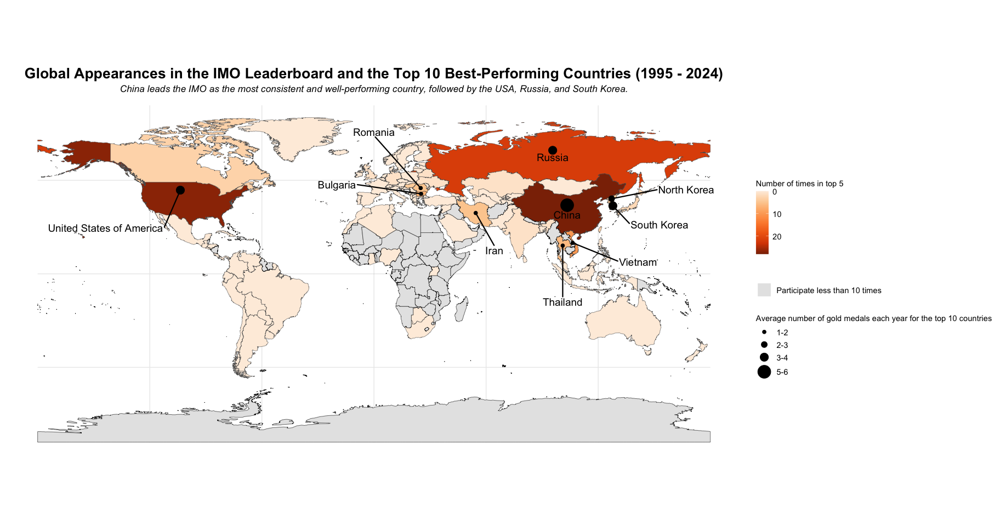
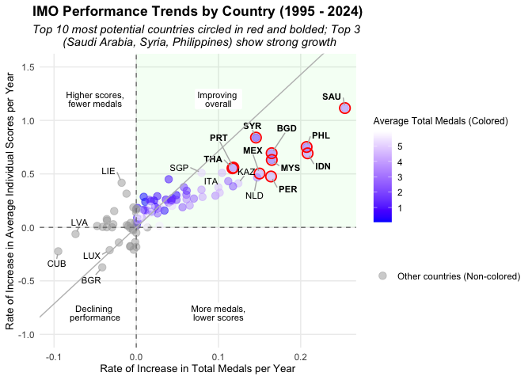
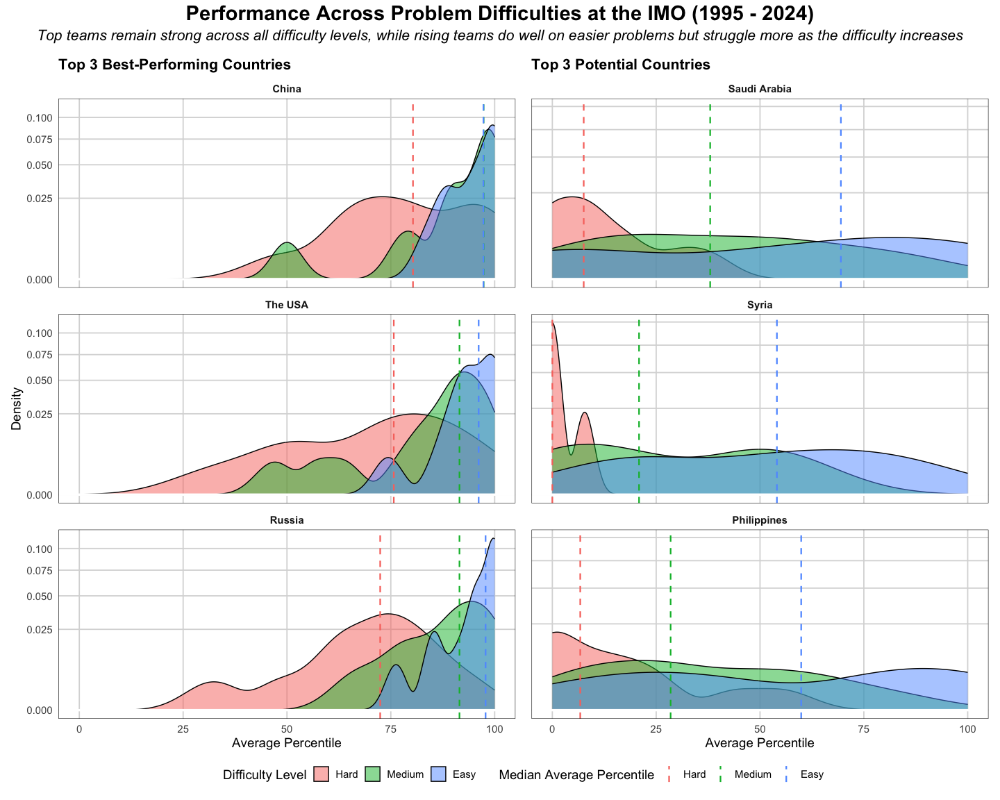

How have countries performed in the IMO over the past 30 years, and what
do problem difficulties reveal about both high-performing and emerging
countries?
================

# Introduction

In this project, we explore the International Mathematical Olympiad
dataset<sup>[\[1\]](https://github.com/rfordatascience/tidytuesday/blob/main/data/2024/2024-09-24/readme.md)</sup>,
published in September 2024. The dataset contains results from the
International Mathematical Olympiad (IMO) spanning from 1959 to 2024. It
includes various aspects of the competition, such as participating
countries, the composition of each team, and the timeline of the event.
It also captures both individual and team results, including scores for
each problem, individual rankings, and medal counts. The dataset
consists of three main tables:

| Table | Description | Key Variables |
|----|----|----|
| `country_results_df.csv` | Summarizes each country’s yearly performance at the IMO, including team composition, problem scores, and medal counts | `year`, `country`, `awards_gold` |
| `individual_results_df.csv` | Contains detailed performance data for each IMO participant, including their country, problem scores, individual rank, and any award received | score for each problem |
| `timeline_df.csv` | Provides an overview of each IMO edition, including the year, host country, number of participating countries and contestants, and the duration of the events |  |

Our main objective is to analyze the performance of countries in the IMO
over the past 30 years. We then explore how problem difficulty levels
(Easy, Medium, Hard) influence the performance of both high-performing
and emerging countries. Specifically, we aim to address the following
questions:

1.  Which countries have performed exceptionally well over the last 30
    years, based on country rankings and gold medals?
2.  Which countries show strong potential to achieve higher scores and
    win more medals in the future?
3.  How do problem difficulty levels help differentiate the capabilities
    of the top-performing and high-potential countries?

# Data Cleaning and Summary

## Data Cleaning

### Step 1: Import Packages and Load Data

We intend to use the following external packages:

1.  `janitor`: For cleaning data. Install with:
    `install.packages("janitor")`
2.  `patchwork`: For combining multiple `ggplot2` plots. Install with:
    `install.packages("patchwork")`
3.  `rnaturalearth`: For accessing world map data. Install with:
    `install.packages("rnaturalearth")`
4.  `rnaturalearthdata`: Provides map data used by `rnaturalearth`.
    Install with: `install.packages("rnaturalearthdata")`
5.  `ggrepel`: For creating non-overlapping text labels in `ggplot2`.
    Install with: `install.packages("ggrepel")`
6.  `sf`: For handling spatial (geographic) data. Install with:
    `install.packages("sf")`
7.  `ggtext`: For rich text formatting in `ggplot2` plots, including
    Markdown and HTML support. Install with:
    `install.packages("ggtext")`
8.  `countrycode`: For converting between different country name/code
    formats. Install with: `install.packages("countrycode")`
9.  `kableExtra`: For creating attractive, well-formatted HTML and LaTeX
    tables. Install with: `install.packages("kableExtra")`

``` r
# Load required packages
library(tidyverse)
library(tidytuesdayR)
library(janitor)
library(patchwork)
library(rnaturalearth)
library(rnaturalearthdata)
library(ggrepel)
library(sf)
library(ggtext)
library(countrycode)
library(kableExtra)

# Load the TidyTuesday dataset
tuesdata <- tidytuesdayR::tt_load("2024-09-24")

# Extract individual data frames
country_results_df <- tuesdata$country_results_df
individual_results_df <- tuesdata$individual_results_df
timeline_df <- tuesdata$timeline_df
```

### Step 2: Remove Variables Not Needed for Analysis

``` r
country_results_df <- country_results_df %>% 
  select(-c(team_size_male, team_size_female, leader, deputy_leader))

individual_results_df <- individual_results_df %>%
  select(-c(contestant, total, individual_rank, award))
```

### Step 3: Handle Missing Values

In this project, we focus only on the first two datasets:
`country_results_df` and `individual_results_df`. Therefore, we will not
address the missing values in the third dataset, `timeline_df`.

#### Step 3a: Visualize the Percentage of Missing Values

``` r
# Function to summarize percentage of missing values
summarize_missing <- function(df) {
  df %>%
    summarize(across(everything(), ~mean(is.na(.)) * 100)) %>%
    pivot_longer(everything(), names_to = "Column", values_to = "Missing (%)") %>%
    arrange(desc(`Missing (%)`)) %>%
    knitr::kable(digits = 2)
}

# Display percentage of missing values
summarize_missing(country_results_df)
```

| Column                    | Missing (%) |
|:--------------------------|------------:|
| p7                        |      100.00 |
| awards_honorable_mentions |       13.62 |
| p1                        |        2.91 |
| p2                        |        2.91 |
| p3                        |        2.91 |
| p4                        |        2.91 |
| p5                        |        2.91 |
| p6                        |        2.91 |
| awards_gold               |        0.05 |
| awards_silver             |        0.05 |
| awards_bronze             |        0.05 |
| year                      |        0.00 |
| country                   |        0.00 |
| team_size_all             |        0.00 |

``` r
summarize_missing(individual_results_df)
```

| Column  | Missing (%) |
|:--------|------------:|
| p7      |       99.93 |
| p1      |        5.04 |
| p2      |        5.04 |
| p3      |        5.04 |
| p4      |        5.04 |
| p5      |        5.04 |
| p6      |        5.04 |
| year    |        0.00 |
| country |        0.00 |

#### Step 3b: Inspect Missing Values in the Two Datasets

Dataset 1: `country_results_df`

``` r
# Summarize number of rows with missing problem scores (p1 to p6)
missing_summary_country <- tibble(
  Metric = c(
    "All problem scores (p1 to p6) missing",
    "p1 missing",
    "p2 missing",
    "p3 missing",
    "p4 missing",
    "p5 missing",
    "p6 missing"
  ),
  Rows_Missing = c(
    country_results_df %>% filter(if_all(p1:p6, is.na)) %>% nrow(),
    country_results_df %>% filter(is.na(p1)) %>% nrow(),
    country_results_df %>% filter(is.na(p2)) %>% nrow(),
    country_results_df %>% filter(is.na(p3)) %>% nrow(),
    country_results_df %>% filter(is.na(p4)) %>% nrow(),
    country_results_df %>% filter(is.na(p5)) %>% nrow(),
    country_results_df %>% filter(is.na(p6)) %>% nrow()
  )
)

# Display missing score summary table
missing_summary_country %>% knitr::kable()
```

| Metric                                | Rows_Missing |
|:--------------------------------------|-------------:|
| All problem scores (p1 to p6) missing |          110 |
| p1 missing                            |          110 |
| p2 missing                            |          110 |
| p3 missing                            |          110 |
| p4 missing                            |          110 |
| p5 missing                            |          110 |
| p6 missing                            |          110 |

``` r
# Filter rows with any missing medal counts (gold, silver, bronze)
missing_medals <- country_results_df %>%
  filter(if_any(c(awards_gold, awards_silver, awards_bronze), is.na))

# Filter rows with missing honorable mention awards
missing_honorable_mentions <- country_results_df %>%
  filter(is.na(awards_honorable_mentions))
missing_honorable_mentions
```

    ## # A tibble: 515 × 14
    ##     year country         team_size_all    p1    p2    p3    p4    p5    p6 p7   
    ##    <dbl> <chr>                   <dbl> <dbl> <dbl> <dbl> <dbl> <dbl> <dbl> <lgl>
    ##  1  2010 Democratic Peo…             6    NA    NA    NA    NA    NA    NA NA   
    ##  2  1991 Democratic Peo…             6    NA    NA    NA    NA    NA    NA NA   
    ##  3  1987 Romania                     6    42    42    40    42    42    42 NA   
    ##  4  1987 Germany                     6    42    42    42    42    42    38 NA   
    ##  5  1987 Union of Sovie…             6    42    42    28    42    42    39 NA   
    ##  6  1987 German Democra…             6    42    42    42    38    42    25 NA   
    ##  7  1987 United States …             6    42    42    35    36    36    29 NA   
    ##  8  1987 Hungary                     6    42    42    35    40    38    21 NA   
    ##  9  1987 Bulgaria                    6    38    42    28    36    41    25 NA   
    ## 10  1987 People's Repub…             6    31    42    27    38    40    22 NA   
    ## # ℹ 505 more rows
    ## # ℹ 4 more variables: awards_gold <dbl>, awards_silver <dbl>,
    ## #   awards_bronze <dbl>, awards_honorable_mentions <dbl>

Dataset 2: `individual_results_df`

``` r
# Summarize number of rows with missing problem scores
missing_summary_individual <- tibble(
  Metric = c(
    "All problem scores (p1 to p6) missing",
    "p1 missing",
    "p2 missing",
    "p3 missing",
    "p4 missing",
    "p5 missing",
    "p6 missing"
  ),
  Rows_Missing = c(
    individual_results_df %>% filter(if_all(p1:p6, is.na)) %>% nrow(),
    individual_results_df %>% filter(is.na(p1)) %>% nrow(),
    individual_results_df %>% filter(is.na(p2)) %>% nrow(),
    individual_results_df %>% filter(is.na(p3)) %>% nrow(),
    individual_results_df %>% filter(is.na(p4)) %>% nrow(),
    individual_results_df %>% filter(is.na(p5)) %>% nrow(),
    individual_results_df %>% filter(is.na(p6)) %>% nrow()
  )
)

missing_summary_individual %>% knitr::kable()
```

| Metric                                | Rows_Missing |
|:--------------------------------------|-------------:|
| All problem scores (p1 to p6) missing |         1093 |
| p1 missing                            |         1093 |
| p2 missing                            |         1093 |
| p3 missing                            |         1093 |
| p4 missing                            |         1093 |
| p5 missing                            |         1093 |
| p6 missing                            |         1093 |

#### Step 3c: Remove Unnecessary Data and Drop Missing Values

The `country_results_df` dataset contains 100% missing values in the
`p7` column, which is expected since the IMO consists of only six
problems. As this column provides no useful information, we will remove
it from all datasets.

Additionally, there are 110 rows in `country_results_df` where all six
problem scores (`p1` to `p6`) are missing. Since these scores are
essential for our analysis and visualizations, we will remove these rows
to maintain data integrity. We also observe that when any of the medal
counts (`awards_gold`, `awards_silver`, or `awards_bronze`) is missing,
the corresponding row also has all six problem scores missing.
Therefore, after removing rows with missing `p1` to `p6` scores, no
further action is needed for the medal columns, as those rows are
removed along with them.

Similarly, in the `individual_results_df` dataset, the `p7` column is
almost entirely missing and will be dropped. There are 1093 rows where
all six problem scores are missing; these will also be removed for the
same reason mentioned above.

Moreover, we note that missing values in the `awards_honorable_mentions`
column of `country_results_df` indicate that the country received no
Honorable Mentions. As such, we impute these missing values with 0.

``` r
# Remove p7 and drop rows where all scores from p1 to p6 are missing
country_results_df <- country_results_df %>%
  select(-p7) %>%
  filter(!if_all(p1:p6, is.na))

individual_results_df <- individual_results_df %>%
  select(-p7) %>%
  filter(!if_all(p1:p6, is.na))

# Replace missing values in 'awards_honorable_mentions' with 0
country_results_df <- country_results_df %>%
  mutate(awards_honorable_mentions = replace_na(awards_honorable_mentions, 0))
```

### Step 4: Filter Data for The Past 30 Years

Since the original dataset spans from 1959 to 2024, we choose to focus
our analysis on the most recent 30 years (1995 to 2024) to better
capture current trends and performances of countries.

``` r
country_results_df <- country_results_df %>%
  filter(year >= 1995)

individual_results_df <- individual_results_df %>%
  filter(year >= 1995)
```

### Step 5: Identify “Special” Countries

Upon examining the data, we identify 18 distinct country codes-‘C01’ to
‘C06’ (in 2022), ‘C11’ to ‘C16’ (in 2023), and ‘C21’ to ‘C26’ (in 2024).
Further investigation reveals that these individuals are from Russia but
were registered as private participants, following Russia’s ban from the
Olympiad in 2022 due to its invasion of
Ukraine<sup>[\[2\]](https://en.wikipedia.org/wiki/International_Mathematical_Olympiad)</sup>.
However, since these participants are officially listed as private
participants, we do not classify them as Russian contestants in this
project. We include only those entries explicitly labeled as ‘Russian
Federation’ under the country field.

``` r
individual_results_df %>%
  distinct(country)
```

    ## # A tibble: 151 × 1
    ##    country                   
    ##    <chr>                     
    ##  1 People's Republic of China
    ##  2 C21                       
    ##  3 United States of America  
    ##  4 Japan                     
    ##  5 Hungary                   
    ##  6 India                     
    ##  7 Republic of Korea         
    ##  8 United Kingdom            
    ##  9 Belarus                   
    ## 10 Lithuania                 
    ## # ℹ 141 more rows

## Key Summary Statistics

### Overview of Key Variables

Here is a summary table of key variables that we are investigating:
`country`, `p1`, `p2`, `p3`, `p4`, `p5`, `p6`, `awards_gold`,
`awards_silver`, `awards_bronze`, `awards_honorable_mentions`:

#### `country`

The dataset includes 133 unique countries, but only 59 of them
participated in all 30 years.

``` r
country_results_df %>%
  distinct(country) %>%
  count() %>%
  pull(n)
```

    ## [1] 133

``` r
country_results_df %>%
  count(country, name = "appearances") %>%
  mutate(percentage = appearances / 30 * 100) %>%
  arrange(desc(percentage)) %>%
  filter(percentage == 100) %>%
  summarize(count = n())
```

    ## # A tibble: 1 × 1
    ##   count
    ##   <int>
    ## 1    59

#### `p1`

The average score for Problem 1 over the 30-year period is 4.6 out of
7.0, indicating moderate performance. Palestine has an average score of
7.0 for this problem; however, this is based on a single contestant over
the entire 30-year period, who scored a perfect 7.0.

``` r
individual_results_df %>%
  summarize(mean_p1_all = mean(p1))
```

    ## # A tibble: 1 × 1
    ##   mean_p1_all
    ##         <dbl>
    ## 1        4.65

``` r
individual_results_df %>%
  group_by(country) %>%
  summarize(mean_p1 = mean(p1)) %>%
  arrange(desc(mean_p1))
```

    ## # A tibble: 151 × 2
    ##    country mean_p1
    ##    <chr>     <dbl>
    ##  1 C01           7
    ##  2 C02           7
    ##  3 C03           7
    ##  4 C04           7
    ##  5 C05           7
    ##  6 C06           7
    ##  7 C11           7
    ##  8 C12           7
    ##  9 C13           7
    ## 10 C14           7
    ## # ℹ 141 more rows

``` r
individual_results_df %>%
  filter(country == "Palestine")
```

    ## # A tibble: 1 × 8
    ##    year country      p1    p2    p3    p4    p5    p6
    ##   <dbl> <chr>     <dbl> <dbl> <dbl> <dbl> <dbl> <dbl>
    ## 1  2022 Palestine     7     1     0     0     6     0

#### `p2`

The average score for Problem 2 over the 30-year period is 2.5 out of
7.0, indicating relatively low performance. Among all countries, China
has the highest average score for Problem 2 at approximately 6.3, with
no other country averaging above 6.0.

``` r
individual_results_df %>%
  summarize(mean_p2_all = mean(p2))
```

    ## # A tibble: 1 × 1
    ##   mean_p2_all
    ##         <dbl>
    ## 1        2.45

``` r
individual_results_df %>%
  group_by(country) %>%
  summarize(mean_p2 = mean(p2)) %>%
  arrange(desc(mean_p2))
```

    ## # A tibble: 151 × 2
    ##    country mean_p2
    ##    <chr>     <dbl>
    ##  1 C01           7
    ##  2 C02           7
    ##  3 C03           7
    ##  4 C04           7
    ##  5 C05           7
    ##  6 C06           7
    ##  7 C11           7
    ##  8 C12           7
    ##  9 C13           7
    ## 10 C14           7
    ## # ℹ 141 more rows

#### `p3`

The average score for Problem 3 over the 30-year period is 0.8 out of
7.0, indicating very low performance. Among all countries, China again
leads with the highest average score of approximately 4.5, while no
other country averages above 4.0. This suggests that most countries
struggle significantly with this problem.

``` r
individual_results_df %>%
  summarize(mean_p3_all = mean(p3))
```

    ## # A tibble: 1 × 1
    ##   mean_p3_all
    ##         <dbl>
    ## 1       0.839

``` r
individual_results_df %>%
  group_by(country) %>%
  summarize(mean_p3 = mean(p3)) %>%
  arrange(desc(mean_p3))
```

    ## # A tibble: 151 × 2
    ##    country mean_p3
    ##    <chr>     <dbl>
    ##  1 C01           7
    ##  2 C05           7
    ##  3 C06           7
    ##  4 C11           7
    ##  5 C12           7
    ##  6 C13           7
    ##  7 C14           7
    ##  8 C15           7
    ##  9 C16           7
    ## 10 C21           6
    ## # ℹ 141 more rows

#### `p4`

The average score for Problem 4 over the 30-year period is 4.3 out of
7.0, indicating moderate performance. China has the highest average
score for this problem at around 6.8, followed closely by Russia and the
USA, each with an average of approximately 6.7.

``` r
individual_results_df %>%
  summarize(mean_p4_all = mean(p4))
```

    ## # A tibble: 1 × 1
    ##   mean_p4_all
    ##         <dbl>
    ## 1        4.25

``` r
individual_results_df %>%
  group_by(country) %>%
  summarize(mean_p4 = mean(p4)) %>%
  arrange(desc(mean_p4))
```

    ## # A tibble: 151 × 2
    ##    country mean_p4
    ##    <chr>     <dbl>
    ##  1 C01           7
    ##  2 C02           7
    ##  3 C03           7
    ##  4 C04           7
    ##  5 C05           7
    ##  6 C06           7
    ##  7 C11           7
    ##  8 C12           7
    ##  9 C13           7
    ## 10 C14           7
    ## # ℹ 141 more rows

#### `p5`

The average score for Problem 5 over the 30-year period is 2.2 out of
7.0, indicating relatively low performance. China and Palestine are the
only two countries with an average score of around 6.0; however,
Palestine’s score is based on a single contestant over the entire
30-year period and therefore does not reflect the country’s overall
performance.

``` r
individual_results_df %>%
  summarize(mean_p5_all = mean(p5))
```

    ## # A tibble: 1 × 1
    ##   mean_p5_all
    ##         <dbl>
    ## 1        2.21

``` r
individual_results_df %>%
  group_by(country) %>%
  summarize(mean_p5 = mean(p5)) %>%
  arrange(desc(mean_p5))
```

    ## # A tibble: 151 × 2
    ##    country mean_p5
    ##    <chr>     <dbl>
    ##  1 C01           7
    ##  2 C02           7
    ##  3 C04           7
    ##  4 C05           7
    ##  5 C06           7
    ##  6 C11           7
    ##  7 C12           7
    ##  8 C13           7
    ##  9 C14           7
    ## 10 C15           7
    ## # ℹ 141 more rows

#### `p6`

The average score for Problem 6 over the 30-year period is 0.6 out of
7.0, indicating extremely low performance. China leads with an average
score of 4.1, followed by the USA with 3.2. No other country achieves an
average score above 3.0, highlighting the high level of difficulty
associated with Problem 6.

``` r
individual_results_df %>%
  summarize(mean_p6_all = mean(p6))
```

    ## # A tibble: 1 × 1
    ##   mean_p6_all
    ##         <dbl>
    ## 1       0.582

``` r
individual_results_df %>%
  group_by(country) %>%
  summarize(mean_p6 = mean(p6)) %>%
  arrange(desc(mean_p6))
```

    ## # A tibble: 151 × 2
    ##    country                    mean_p6
    ##    <chr>                        <dbl>
    ##  1 C05                           7   
    ##  2 C21                           7   
    ##  3 People's Republic of China    4.13
    ##  4 C01                           4   
    ##  5 C06                           4   
    ##  6 United States of America      3.17
    ##  7 Russian Federation            2.65
    ##  8 Republic of Korea             2.51
    ##  9 C11                           2   
    ## 10 C16                           2   
    ## # ℹ 141 more rows

#### `awards_gold`

China has earned the most gold medals over the past 30 years, with a
total of 150. The USA follows with 114 gold medals, and Russia ranks
third with 97.

``` r
country_results_df %>%
  group_by(country) %>%
  summarize(total_gold = sum(awards_gold)) %>%
  arrange(desc(total_gold))
```

    ## # A tibble: 133 × 2
    ##    country                    total_gold
    ##    <chr>                           <dbl>
    ##  1 People's Republic of China        150
    ##  2 United States of America          114
    ##  3 Russian Federation                 97
    ##  4 Republic of Korea                  94
    ##  5 Vietnam                            57
    ##  6 Romania                            50
    ##  7 Japan                              46
    ##  8 Islamic Republic of Iran           45
    ##  9 Taiwan                             45
    ## 10 Ukraine                            42
    ## # ℹ 123 more rows

#### `awards_silver`

Iran has earned the most silver medals over the past 30 years, with 96,
followed by Taiwan with 94 and Japan with 86.

``` r
country_results_df %>%
  group_by(country) %>%
  summarize(total_silver = sum(awards_silver)) %>%
  arrange(desc(total_silver))
```

    ## # A tibble: 133 × 2
    ##    country                  total_silver
    ##    <chr>                           <dbl>
    ##  1 Islamic Republic of Iran           96
    ##  2 Taiwan                             94
    ##  3 Japan                              86
    ##  4 Romania                            84
    ##  5 Bulgaria                           80
    ##  6 Hungary                            77
    ##  7 Republic of Korea                  75
    ##  8 Vietnam                            75
    ##  9 Germany                            72
    ## 10 Türkiye                            72
    ## # ℹ 123 more rows

#### `awards_bronze`

Slovakia, Croatia, and France have earned the most bronze medals, with
86, 84, and 82 medals respectively.

``` r
country_results_df %>%
  group_by(country) %>%
  summarize(total_bronze = sum(awards_bronze)) %>%
  arrange(desc(total_bronze))
```

    ## # A tibble: 133 × 2
    ##    country        total_bronze
    ##    <chr>                 <dbl>
    ##  1 Slovakia                 86
    ##  2 Croatia                  84
    ##  3 France                   82
    ##  4 Belarus                  79
    ##  5 Georgia                  76
    ##  6 Israel                   76
    ##  7 Czech Republic           75
    ##  8 Mexico                   75
    ##  9 Hong Kong                74
    ## 10 Kazakhstan               74
    ## # ℹ 123 more rows

#### `awards_honorable_mentions`

An Honorable Mention is awarded to participants who do not win a medal
but score 7 points on at least one
problem<sup>[\[2\]](https://en.wikipedia.org/wiki/International_Mathematical_Olympiad)</sup>.
South Africa, Slovenia, and Latvia have earned the most honorable
mentions, with 77, 72, and 71 times respectively.

``` r
country_results_df %>%
  group_by(country) %>%
  summarize(total_honorable_mentions = sum(awards_honorable_mentions)) %>%
  arrange(desc(total_honorable_mentions))
```

    ## # A tibble: 133 × 2
    ##    country      total_honorable_mentions
    ##    <chr>                           <dbl>
    ##  1 South Africa                       77
    ##  2 Slovenia                           72
    ##  3 Latvia                             71
    ##  4 Estonia                            68
    ##  5 Azerbaijan                         67
    ##  6 Morocco                            67
    ##  7 Sri Lanka                          67
    ##  8 Finland                            65
    ##  9 Lithuania                          65
    ## 10 Macau                              64
    ## # ℹ 123 more rows

# Visualization 1: Which countries have performed exceptionally well over the last 30 years, based on country rankings and gold medals?

The first visualization explores country-level performance at the
International Mathematical Olympiad (IMO) from 1995 to 2024, focusing on
consistent and excellent performance. After counting the number of times
each country appears in the annual top 5 rankings based on total team
score (**Consistency**), we select the top 10 countries and highlight
their average number of gold medals (**Well-performance**). By combining
these two metrics on a global map, this visualization identifies nations
that have demonstrated both sustained participation at the top level and
outstanding performance over time.

## Metric Definition

Before interpreting the results, we define two key metrics:
**consistency** and **well-performance**. Consistency refers to two
aspects: a country’s regular participation in the IMO and its recurring
presence within a specific range of rankings (e.g., top 5, top 10,
etc.). This metric highlights how stable a country’s performance is over
time, regardless of whether it wins top awards each year.
Well-performance is defined as the average number of gold medals a
country earns annually between 1995 and 2024. Since gold medals are
typically awarded to the top 1/12 of all
participants<sup>[\[2\]](https://en.wikipedia.org/wiki/International_Mathematical_Olympiad)</sup>,
this measure reflects the strength of a country’s highest-performing
individuals. Together, these two dimensions offer a broader picture of
national performance at the IMO. A country with both consistent and
high-level performance would frequently appear in the top 5 team
rankings and earn a high average number of gold medals.

It’s worth noting that consistency and high performance do not always go
hand in hand. A country can exhibit consistency by regularly
participating and consistently placing in the *middle* tier, even if it
rarely secures gold medals. Conversely, a country might achieve
outstanding results in a few specific years but lack regular
participation or sustained strong performance over time.

These two metrics collectively help us address the broader research
question by examining both country rankings (linked to **consistency**)
and the distribution of gold medals (linked to **well-performance**).

## Data Preparation

To calculate the consistency and performance metrics, we follow these
steps:

1.  Annual Total Scores: We calculate the total score each country earns
    each year by summing the scores of all six IMO problems.

2.  Filter for Frequent Participants: We filter the dataset to include
    only countries that participate in the IMO at least 10 times over
    the past 30 years. This threshold reflects our definition of
    **consistency** as frequent and sustained involvement. With this
    cutoff, we still capture the performance of over 100 countries,
    providing a broad and representative overview.

3.  Top 5 Appearances: We count how many times each country appears in
    the top 5 rankings and use this to identify the top 10 most
    **consistent** and **best-performing** countries. If two or more
    countries have the same number of top 5 appearances, we use the
    average number of gold medals as a tiebreaker. This approach
    prioritizes countries with stronger overall performance. For
    example, although both Iran and Romania appear five times in the top
    5, Romania ranks higher due to a higher average gold medal count. A
    similar situation occurs between North Korea and Hungary, allowing
    North Korea to secure a spot in the top 10.

4.  Gold Medal Average: We compute the average number of gold medals
    earned by the top 10 most **consistent** and **best-performing**
    countries.

``` r
# Calculate total score per row
country_total_score_all_years <- country_results_df %>%
  mutate(total_score = p1 + p2 + p3 + p4 + p5 + p6)

# Filter countries with at least 10 appearances
country_results_df_filter <- country_results_df %>%
  count(country) %>%
  filter(n >= 10) %>%
  arrange(desc(n))

# Calculate number of years each country was in the top 5 total score
country_number_of_years_top_5 <- country_total_score_all_years %>%
  group_by(year) %>%
  slice_max(total_score, n = 5) %>%
  ungroup() %>%
  count(country, name = "number_of_years_top_5_score") %>%
  arrange(desc(number_of_years_top_5_score))

# Join with filtered country list and fill missing values with 0
country_number_of_years_top_5 <- country_results_df_filter %>%
  select(country) %>%
  left_join(country_number_of_years_top_5, by = "country") %>%
  mutate(number_of_years_top_5_score = coalesce(number_of_years_top_5_score, 0))

# Compute average number of gold medals per appearance
country_average_gold_medals <- country_results_df %>%
  group_by(country) %>%
  summarize(average_gold_medals = mean(awards_gold)) %>%
  arrange(desc(average_gold_medals))
```

``` r
# Join and rank countries by top 5 appearances and average gold medals
full_data_set <- country_average_gold_medals %>%
  left_join(country_number_of_years_top_5, by = "country") %>%
  arrange(desc(number_of_years_top_5_score), desc(average_gold_medals)) %>%
  slice_head(n = 10)

# Extract top 10 countries
top_10_country_list <- full_data_set %>%
  pull(country)

# Filter average gold medals data to only include top 10 countries
country_average_gold_medals <- country_average_gold_medals %>%
  filter(country %in% top_10_country_list)
```

``` r
top_10_performing <- full_data_set %>%
  rename(
    "Country" = 1,
    "Average Gold Medals per Year" = 2,
    "Number of Years in Top 5 Rankings" = 3
  )

# Render formatted table
kable(
  top_10_performing,
  align = c("l", "c", "c"),
  caption = "Top 10 Best-Performing Countries"
) %>%
  kable_styling(bootstrap_options = c("striped", "hover"))
```

<table class="table table-striped table-hover" style="margin-left: auto; margin-right: auto;">
<caption>
Top 10 Best-Performing Countries
</caption>
<thead>
<tr>
<th style="text-align:left;">
Country
</th>
<th style="text-align:center;">
Average Gold Medals per Year
</th>
<th style="text-align:center;">
Number of Years in Top 5 Rankings
</th>
</tr>
</thead>
<tbody>
<tr>
<td style="text-align:left;">
People’s Republic of China
</td>
<td style="text-align:center;">
5.172414
</td>
<td style="text-align:center;">
28
</td>
</tr>
<tr>
<td style="text-align:left;">
United States of America
</td>
<td style="text-align:center;">
3.800000
</td>
<td style="text-align:center;">
27
</td>
</tr>
<tr>
<td style="text-align:left;">
Russian Federation
</td>
<td style="text-align:center;">
3.592593
</td>
<td style="text-align:center;">
22
</td>
</tr>
<tr>
<td style="text-align:left;">
Republic of Korea
</td>
<td style="text-align:center;">
3.133333
</td>
<td style="text-align:center;">
19
</td>
</tr>
<tr>
<td style="text-align:left;">
Vietnam
</td>
<td style="text-align:center;">
1.900000
</td>
<td style="text-align:center;">
10
</td>
</tr>
<tr>
<td style="text-align:left;">
Bulgaria
</td>
<td style="text-align:center;">
1.333333
</td>
<td style="text-align:center;">
7
</td>
</tr>
<tr>
<td style="text-align:left;">
Thailand
</td>
<td style="text-align:center;">
1.133333
</td>
<td style="text-align:center;">
6
</td>
</tr>
<tr>
<td style="text-align:left;">
Romania
</td>
<td style="text-align:center;">
1.666667
</td>
<td style="text-align:center;">
5
</td>
</tr>
<tr>
<td style="text-align:left;">
Islamic Republic of Iran
</td>
<td style="text-align:center;">
1.500000
</td>
<td style="text-align:center;">
5
</td>
</tr>
<tr>
<td style="text-align:left;">
Democratic People’s Republic of Korea
</td>
<td style="text-align:center;">
2.200000
</td>
<td style="text-align:center;">
4
</td>
</tr>
</tbody>
</table>

Additionally, some data cleaning and pre-labeling are necessary due to
inconsistencies in country naming between the maps library and the IMO
dataset, as well as a few special cases. One such case is Greenland,
which is treated as separate from Denmark in mapping libraries, despite
being part of the Kingdom of Denmark in the context of the IMO.

For pre-labeling, we categorize the average number of gold medals into
three groups based on performance: countries earning 1 to 2 gold medals,
those earning 3 to 4, and those averaging more than 5 gold medals
annually.

``` r
# Standardize country names for consistency
standardize_country_names <- function(df) {
  df %>%
    mutate(country = case_when(
      country == "People's Republic of China" ~ "China",
      country == "Russian Federation" ~ "Russia",
      country == "Islamic Republic of Iran" ~ "Iran",
      country == "Republic of Korea" ~ "South Korea",
      country == "Czech Republic" ~ "Czechia",
      country == "Türkiye" ~ "Turkey",
      country == "Macau" ~ "Macao",
      country == "Republic of Moldova" ~ "Moldova",
      country == "Democratic People's Republic of Korea" ~ "North Korea",
      TRUE ~ country
    ))
}

# Apply standardization
country_number_of_years_top_5_rename <- standardize_country_names(country_number_of_years_top_5)
country_average_gold_medals_rename <- standardize_country_names(country_average_gold_medals)

# Load world map and fix country names
world <- ne_countries(scale = "medium", returnclass = "sf")
world$name[world$name == "Greenland"] <- "Denmark"

# Join data to world map
country_number_of_years_top_5_map <- world %>%
  left_join(country_number_of_years_top_5_rename, by = c("name" = "country"))

country_average_gold_medals_map <- world %>%
  left_join(country_average_gold_medals_rename, by = c("name" = "country"))

# Create centroids and categorize average gold medals
centroids <- st_centroid(country_average_gold_medals_map)

centroids$average_gold_medals_cat <- cut(
  centroids$average_gold_medals,
  breaks = c(0, 1, 2, 3, 4, 5, Inf),
  labels = c("0-1", "1-2", "2-3", "3-4", "4-5", "5-6"),
  include.lowest = TRUE
)

# Keep only valid data
centroids_clean <- centroids %>%
  filter(!is.na(average_gold_medals))

centroids_clean_coords <- cbind(centroids_clean, st_coordinates(centroids_clean))

# Create label nudges for overlapping countries
nudge_table <- tibble::tibble(
  name = c(
    "China", "United States of America", "Russia", "South Korea", "North Korea",
    "Vietnam", "Iran", "Thailand", "Bulgaria", "Romania"
  ),
  nudge_x = c(0, -40, 0, 25, 40, 35, 10, 0, -45, -25),
  nudge_y = c(-5, -20, -1, -10, 5, -10, -20, -30, 5, 30)
)

centroids_label <- centroids_clean_coords %>%
  left_join(nudge_table, by = "name")

# Split map data by presence of values for highlighting
country_number_of_years_top_5_map_not_na <- country_number_of_years_top_5_map %>%
  filter(!is.na(number_of_years_top_5_score))

country_number_of_years_top_5_map_na <- country_number_of_years_top_5_map %>%
  filter(is.na(number_of_years_top_5_score))
```

## Plot

``` r
plot_1 <- ggplot() +
  # Map: countries with available top 5 data
  geom_sf(
    data = country_number_of_years_top_5_map_not_na,
    aes(fill = number_of_years_top_5_score)
  ) +
  scale_fill_distiller(
    palette = "Oranges",
    trans = "reverse",
    na.value = "grey90"
  ) +

  # Map: countries with no top 5 data (less than 10 participations)
  geom_sf(
    data = country_number_of_years_top_5_map_na,
    fill = "grey90",
    color = "black",
    size = 0.2,
    show.legend = FALSE,
    inherit.aes = FALSE
  ) +

  # Dummy point to show legend for countries with <10 participations
  geom_point(
    data = data.frame(dummy = "Participate less than 10 times", x = 0, y = 0),
    aes(x = x, y = y, color = dummy),
    size = 0,
    show.legend = TRUE
  ) +
  scale_color_manual(
    name = "",
    values = c("Participate less than 10 times" = "grey90")
  ) +
  guides(
    color = guide_legend(override.aes = list(shape = 15, size = 8))
  ) +

  # Bubble sizes for gold medals
  geom_sf(
    data = centroids_clean,
    aes(size = average_gold_medals_cat),
    color = "black"
  ) +
  scale_size_manual(
    values = c("0-1" = 1, "1-2" = 2, "2-3" = 3.5, "3-4" = 5, "4-5" = 6.5, "5-6" = 8)
  ) +

  # Country labels with nudges
  geom_text_repel(
    data = centroids_label,
    aes(x = X, y = Y, label = name),
    size = 5,
    color = "black",
    segment.size = 0.8,
    nudge_x = centroids_label$nudge_x,
    nudge_y = centroids_label$nudge_y
  ) +

  # Theming
  theme_minimal() +
  theme(
    plot.title = element_text(size = 20, hjust = 0.5, face = "bold"),
    plot.subtitle = element_text(size = 13, hjust = 0.5, face = "italic", margin = margin(b = 10)),
    legend.text = element_text(size = 11),
    axis.title = element_blank(),
    axis.text = element_blank(),
    axis.ticks = element_blank()
  ) +

  # Titles and labels
  labs(
    title = "Global Appearances in the IMO Leaderboard and the Top 10 Best-Performing Countries (1995 - 2024)",
    subtitle = "China leads the IMO as the most consistent and well-performing country, followed by the USA, Russia, and South Korea.",
    fill = "Number of times in top 5",
    size = "Average number of gold medals each year for the top 10 countries"
  ) +

  # Ordering of legends
  guides(
    fill  = guide_colorbar(order = 1),
    color = guide_legend(order = 2, override.aes = list(shape = 15, size = 8)),
    size  = guide_legend(order = 3)
  )

plot_1
```



## Discussion

Overall, more than 100 countries have participated in the IMO at least
10 times over the past 30 years. Most European countries, as well as the
majority of nations in the Americas and Asia, have taken part in the
contest at various points. Africa, however, is the only continent with
relatively low participation in the IMO. This disparity reflects broader
challenges such as limited investment in education, underdeveloped
mathematics programs, and the persistent impact of political
instability, economic constraints, and social issues across many African
nations<sup>[\[3\]](https://pmc.ncbi.nlm.nih.gov/articles/PMC8988107/)</sup>.

A standout group of ‘Big 4’ countries - **China**, **the USA**,
**Russia**, and **South Korea** - leads the IMO in both performance and
consistency. China dominates with an average of 5.2 gold medals per
year, nearly a full team’s worth. The USA averages 3.8 gold medals
annually, followed by Russia with 3.6 and South Korea with over 3. All
four countries maintain strong averages and frequent top-five finishes -
especially Russia, despite its ban in
2022<sup>[\[4\]](https://web.archive.org/web/20220331101006/https://www.imo-official.org/)</sup>.
Other high-performing countries such as Vietnam, Bulgaria, Thailand,
Iran, Romania, and North Korea also show consistent results, averaging
1.3 to 2.2 golds annually, with several achieving multiple top-five
placements.

China’s IMO dominance can be attributed to a combination of strong
motivation, a large population, and intensive early training. Olympiad
success offers major incentives-top university placements, scholarships,
and national recognition-making it a compelling alternative to the
highly competitive Gaokao exam. A vast talent pool, paired with a
culture that deeply values education, fosters early and focused
mathematical development. This is further reinforced by specialized
instructors, rigorous selection processes, and dedicated school time for
Olympiad
preparation<sup>[\[5\]](https://postulanteuniversitario.blogspot.com/2016/07/what-explains-chinese-domination-at.html)</sup>.

In conclusion, countries like China, the USA, Russia, and South Korea
exemplify both consistency and excellence in mathematical education.
Their success reflects not only deep talent pools, but also robust
national infrastructures that support mathematics training and
competition. More broadly, these patterns highlight how a few countries
continue to lead the way in the global pursuit of mathematical
excellence at the International Mathematical Olympiad.

# Visualization 2: Which countries show strong potential to achieve higher scores and win more medals in the future?

The second visualization examines country-level performance at the
International Mathematical Olympiad (IMO) from 1995 to 2024, focusing on
each country’s potential to achieve higher average scores per team
member and secure more medals. It highlights how improvements in
individual scores can translate into greater medal counts.

A scatter plot is used to visualize countries based on their rate of
increase in average individual scores per year versus the rate of
increase in medals per year. Potential countries are colored, while
non-potential countries are left uncolored. This visualization aims to
identify countries that have consistently increased both their average
individual scores and medal tallies over time.

## Metric Definition

We define **potential** countries as nations that exhibit statistically
significant positive trends in either (or both) the rate of increase in
total medals per year and the average score per team member per year,
but have not yet established themselves as top-performing in terms of
total medals achieved. These countries demonstrate positive momentum,
with trends suggesting the possibility of converting improved scores
into more medals in the future. To identify such countries, we compute
linear regression slopes over a 30-year period (1995 - 2024),
considering only those with at least 10 years of IMO participation to
ensure the stability and reliability of trend estimation.

## Data Preparation

### a. Derived Metrics

To quantify trends in performance:

`avg_score_per_member`: Calculated by summing a country’s total IMO
scores across problems `p1`-`p6` in a given year and dividing by the
team size. This accounts for differences in team sizes, enabling fairer
comparisons across countries.

`total_medals`: The total number of gold, silver, and bronze medals won
by a country in a given year.

### b. Linear Trend Analysis

We apply two separate linear regressions to each country’s data across
the years: one models the trend in total medals (`total_medals` ~
`year`), and the other models the trend in average score per team member
(`avg_score_per_member` ~ `year`). The slope coefficients from these
regressions represent the rate of change in performance over time-that
is, how quickly a country’s performance is improving or declining in
terms of medal count and average individual score.

### c. Average Medal Count

We also compute each country’s average total medals across all years of
participation. This provides context for interpreting improvement trends
and helps identify countries that are improving but have not yet won
many medals-signaling strong potential for future success.

### d. Country Abbreviations

To improve visual clarity, we use the `countrycode` R package to convert
full country names into three-letter ISO codes. This significantly
reduces the data-to-ink ratio by minimizing text clutter, allowing the
chart to better highlight underlying data patterns.

## Description of Plot

We construct a scatter plot with the following axes:

X-axis: Rate of increase in total medals - represented by the slope of
the linear model (`total_medals` ~ `year`).

Y-axis: Rate of increase in average score per team member - represented
by the slope of the linear model (`avg_score_per_member` ~ `year`).

### a. Quadrants

The scatter plot is divided into four quadrants to highlight distinct
performance patterns:

- **Top-Right**: Countries improving in both metrics - these are our
  **key focus**, as they demonstrate strong and balanced growth.
- **Top-Left**: Countries with rising average individual scores but
  declining medal counts - suggesting improving team performance that
  has yet to translate into more medals.
- **Bottom-Right**: Countries gaining medals despite declining average
  individual scores - this may reflect performance imbalances,
  potentially driven by a few standout individuals rather than overall
  team strength.
- **Bottom-Left**: Countries declining in both metrics - indicating a
  lack of positive trajectory in recent years.

Our primary focus is the **Top-Right quadrant**, highlighting countries
that are consistently improving in both scoring capability and medal
acquisition - strong indicators of positive trajectory and future
competitiveness.

### b. Color Encoding

We color only the countries in the **Top-Right quadrant**. Each country
is plotted as a point, colored according to its average total medal
count. Notably, the color scale is intentionally reversed from the
typical convention: darker shades represent countries with lower average
medal counts, while lighter shades correspond to higher averages. This
design choice supports the core objective of the visualization - to
spotlight countries that are improving but have yet to achieve high
medal counts. By assigning darker colors to these underperforming yet
rising countries, we make it easier to identify promising candidates
that may not have been historical top performers but are showing strong
upward momentum.

### c. Reference Line: y = x

We include a diagonal reference line (scaled appropriately) in the
scatter plot to represent balanced improvement-that is, countries
improving at similar rates in both average individual scores and total
medals. Countries (in the **Top-Right quadrant**) positioned close to
this line are likely converting score improvements into medals
efficiently, while those farther away exhibit imbalances in their growth
trajectories (e.g., improving in one metric but not the other).

To quantify this alignment, we calculate the absolute difference between
the medal slope and score slope. When considered alongside each
country’s overall rate of improvement and average medal count, this
provides a robust, multi-dimensional framework for ranking countries by
future potential.

``` r
# Calculate average individual scores and total medals per country per year
country_scores <- country_results_df %>%
  mutate(
    avg_score_per_member = rowSums(select(., p1:p6)) / team_size_all,
    total_medals = awards_gold + awards_silver + awards_bronze
  ) %>%
  select(year, country, total_medals, avg_score_per_member)

# Compute trends for countries with at least 10 years of data
trends_df <- country_scores %>%
  group_by(country) %>%
  filter(n() >= 10) %>%
  summarize(
    medals_slope = coef(lm(total_medals ~ year))[2],
    score_slope = coef(lm(avg_score_per_member ~ year))[2],
    avg_medals = mean(total_medals),
    .groups = "drop"
  ) %>%
  mutate(
    country_abbr = countrycode(country, "country.name", "iso3c"),
    is_top_right = medals_slope > 0 & score_slope > 0
  )

# Identify top potential countries
top_potential_countries <- trends_df %>%
  filter(is_top_right) %>%
  mutate(
    combined_rate = (medals_slope + score_slope) / 2,
    distance_to_yx = abs(medals_slope - score_slope)
  ) %>%
  arrange(
    desc(combined_rate),
    distance_to_yx
  ) %>%
  slice_head(n = 10) %>%
  select(
    Country = country,
    Country_Code = country_abbr,
    `Medal Trend` = medals_slope,
    `Score Trend` = score_slope,
    `Avg Medals` = avg_medals,
    `Improvement Balance` = distance_to_yx,
    `Combined Rate` = combined_rate
  ) %>%
  mutate(across(where(is.numeric), ~ round(., 4))) %>%
  arrange(`Avg Medals`) %>%
  pull(Country)

# Mark top 10 in trends data
trends_df <- trends_df %>%
  mutate(is_top10 = country %in% top_potential_countries)

# Step 5: Define quadrant labels for plot
quadrant_labels <- data.frame(
  x = c(0.10, 0.10, -0.05, -0.05),
  y = c(1.2, -0.8, -0.8, 1.2),
  label = c(
    "Improving \noverall",
    "More medals,\nlower scores",
    "Declining \nperformance",
    "Higher scores,\nfewer medals"
  ),
  hjust = 0.5
)

# Calculate axis ranges and slope-adjusted reference
x_range <- 0.25 - (-0.1)
y_range <- 1.5 - (-1.0)
slope_adjusted <- y_range / x_range
```

## Sorting Rationale

We sort the data based on the **combined rate**, which considers both
the rate of increase in average individual scores and total medals. This
ensures that the top potential countries are those showing a high rate
of increase in both metrics.

If two countries have the same `combined_rate`, we then consider the
distance of each country’s point to the line *y = x* in our plot. This
is because countries closer to this line are likely to have similar
growth rates in total medals and average individual scores-indicating
that their overall team performance is improving in a balanced way. In
other words, an increase in individual scores is effectively translating
into more medals, and vice versa.

*Note: This secondary sorting criterion (distance to the line y = x)
does not affect the current top 10 rankings, since no two countries
share the same combined_rate. However, it may become relevant when
analyzing the top 50 countries, where more ties in combined_rate may
occur, especially among less prominent countries near the origin.*

``` r
# Identify top 10 countries with strongest and most balanced positive trends
top_potential_countries <- trends_df %>%
  filter(is_top_right) %>%
  mutate(
    combined_rate = (medals_slope + score_slope) / 2,
    distance_to_yx = abs(medals_slope - score_slope)
  ) %>%
  arrange(
    desc(combined_rate),   # prioritize overall improvement
    distance_to_yx         # then favor balance (closer to y = x)
  ) %>%
  slice_head(n = 10) %>%
  select(
    Country = country,
    Country_Code = country_abbr,
    `Medal Trend` = medals_slope,
    `Score Trend` = score_slope,
    `Avg Medals` = avg_medals,
    `Improvement Balance` = distance_to_yx,
    `Combined Rate` = combined_rate
  ) %>%
  mutate(across(where(is.numeric), round, 4))

# Render formatted table
kable(
  top_potential_countries,
  align = c("l", "c", "c", "c", "c", "c", "c", "c"),
  caption = "Top 10 Potential Countries"
) %>%
  kable_styling(bootstrap_options = c("striped", "hover"))
```

<table class="table table-striped table-hover" style="margin-left: auto; margin-right: auto;">
<caption>
Top 10 Potential Countries
</caption>
<thead>
<tr>
<th style="text-align:left;">
Country
</th>
<th style="text-align:center;">
Country_Code
</th>
<th style="text-align:center;">
Medal Trend
</th>
<th style="text-align:center;">
Score Trend
</th>
<th style="text-align:center;">
Avg Medals
</th>
<th style="text-align:center;">
Improvement Balance
</th>
<th style="text-align:center;">
Combined Rate
</th>
</tr>
</thead>
<tbody>
<tr>
<td style="text-align:left;">
Saudi Arabia
</td>
<td style="text-align:center;">
SAU
</td>
<td style="text-align:center;">
0.2538
</td>
<td style="text-align:center;">
1.1154
</td>
<td style="text-align:center;">
2.8500
</td>
<td style="text-align:center;">
0.8616
</td>
<td style="text-align:center;">
0.6846
</td>
</tr>
<tr>
<td style="text-align:left;">
Syria
</td>
<td style="text-align:center;">
SYR
</td>
<td style="text-align:center;">
0.1456
</td>
<td style="text-align:center;">
0.8395
</td>
<td style="text-align:center;">
1.1875
</td>
<td style="text-align:center;">
0.6939
</td>
<td style="text-align:center;">
0.4925
</td>
</tr>
<tr>
<td style="text-align:left;">
Philippines
</td>
<td style="text-align:center;">
PHL
</td>
<td style="text-align:center;">
0.2072
</td>
<td style="text-align:center;">
0.7518
</td>
<td style="text-align:center;">
2.1034
</td>
<td style="text-align:center;">
0.5445
</td>
<td style="text-align:center;">
0.4795
</td>
</tr>
<tr>
<td style="text-align:left;">
Indonesia
</td>
<td style="text-align:center;">
IDN
</td>
<td style="text-align:center;">
0.2084
</td>
<td style="text-align:center;">
0.6925
</td>
<td style="text-align:center;">
3.3448
</td>
<td style="text-align:center;">
0.4841
</td>
<td style="text-align:center;">
0.4505
</td>
</tr>
<tr>
<td style="text-align:left;">
Bangladesh
</td>
<td style="text-align:center;">
BGD
</td>
<td style="text-align:center;">
0.1647
</td>
<td style="text-align:center;">
0.6938
</td>
<td style="text-align:center;">
2.2500
</td>
<td style="text-align:center;">
0.5291
</td>
<td style="text-align:center;">
0.4292
</td>
</tr>
<tr>
<td style="text-align:left;">
Malaysia
</td>
<td style="text-align:center;">
MYS
</td>
<td style="text-align:center;">
0.1648
</td>
<td style="text-align:center;">
0.6304
</td>
<td style="text-align:center;">
1.9667
</td>
<td style="text-align:center;">
0.4656
</td>
<td style="text-align:center;">
0.3976
</td>
</tr>
<tr>
<td style="text-align:left;">
Portugal
</td>
<td style="text-align:center;">
PRT
</td>
<td style="text-align:center;">
0.1181
</td>
<td style="text-align:center;">
0.5591
</td>
<td style="text-align:center;">
1.7000
</td>
<td style="text-align:center;">
0.4410
</td>
<td style="text-align:center;">
0.3386
</td>
</tr>
<tr>
<td style="text-align:left;">
Thailand
</td>
<td style="text-align:center;">
THA
</td>
<td style="text-align:center;">
0.1170
</td>
<td style="text-align:center;">
0.5525
</td>
<td style="text-align:center;">
4.8667
</td>
<td style="text-align:center;">
0.4355
</td>
<td style="text-align:center;">
0.3348
</td>
</tr>
<tr>
<td style="text-align:left;">
Mexico
</td>
<td style="text-align:center;">
MEX
</td>
<td style="text-align:center;">
0.1499
</td>
<td style="text-align:center;">
0.5034
</td>
<td style="text-align:center;">
3.8667
</td>
<td style="text-align:center;">
0.3535
</td>
<td style="text-align:center;">
0.3267
</td>
</tr>
<tr>
<td style="text-align:left;">
Peru
</td>
<td style="text-align:center;">
PER
</td>
<td style="text-align:center;">
0.1639
</td>
<td style="text-align:center;">
0.4760
</td>
<td style="text-align:center;">
3.9643
</td>
<td style="text-align:center;">
0.3120
</td>
<td style="text-align:center;">
0.3199
</td>
</tr>
</tbody>
</table>

## Plot

``` r
plot_2 <- ggplot() +
  # Quadrant backgrounds
  annotate("rect", xmin = 0, xmax = Inf, ymin = 0, ymax = Inf, fill = "palegreen", alpha = 0.1) +
  annotate("rect", xmin = 0, xmax = Inf, ymin = -Inf, ymax = 0, fill = "white", alpha = 0.1) +
  annotate("rect", xmin = -Inf, xmax = 0, ymin = -Inf, ymax = 0, fill = "white", alpha = 0.1) +
  annotate("rect", xmin = -Inf, xmax = 0, ymin = 0, ymax = Inf, fill = "white", alpha = 0.1) +

  # Quadrant labels
  geom_label(
    data = quadrant_labels,
    aes(x = x, y = y, label = label, hjust = hjust),
    size = 3, label.size = NA, lineheight = 0.8
  ) +

  # All countries (non-top-10)
  geom_point(
    data = trends_df,
    aes(
      x = medals_slope,
      y = score_slope,
      color = ifelse(is_top_right, avg_medals, NA),
      shape = ifelse(is_top_right, "Other countries (Non-colored)", " ")
    ),
    alpha = 0.5, size = 3
  ) +

  # Highlight top 10 countries
  geom_point(
    data = filter(trends_df, is_top10),
    aes(x = medals_slope, y = score_slope),
    shape = 1, size = 4, color = "red", stroke = 1, alpha = 1.0
  ) +

  # Country labels
  geom_text_repel(
    data = trends_df,
    aes(x = medals_slope, y = score_slope, label = country_abbr),
    size = 3,
    fontface = ifelse(trends_df$is_top10, "bold", "plain"),
    box.padding = 0.5,
    point.padding = 0.3,
    segment.color = "grey70",
    min.segment.length = 0.2,
    max.overlaps = 15
  ) +

  # Reference lines
  geom_vline(xintercept = 0, linetype = "dashed", color = "grey50") +
  geom_hline(yintercept = 0, linetype = "dashed", color = "grey50") +
  geom_abline(slope = slope_adjusted, intercept = 0, linetype = "solid", color = "grey") +

  # Color and shape scales
  scale_color_gradient(
    low = "blue", high = "white",
    name = "Average Total Medals (Colored)",
    na.value = "grey65"
  ) +
  scale_shape_manual(
    name = "    ",
    values = c("Other countries (Non-colored)" = 19, " " = 19),
    guide = guide_legend(override.aes = list(
      color = c("white", "grey65"),
      alpha = c(0.5, 0.5)
    ))
  ) +

  # Labels and titles
  labs(
    title = "IMO Performance Trends by Country (1995 - 2024)",
    subtitle = "Top 10 most potential countries circled in red and bolded; Top 3 \n (Saudi Arabia, Syria, Philippines) show strong growth",
    x = "Rate of Increase in Total Medals per Year",
    y = "Rate of Increase in Average Individual Scores per Year"
  ) +

  # Coordinate limits & theme
  coord_cartesian(xlim = c(-0.1, 0.25), ylim = c(-1.0, 1.5)) +
  theme_minimal(base_size = 11) +
  theme(
    panel.grid.minor = element_blank(),
    legend.position = "right",
    plot.title = element_text(face = "bold", hjust = 0.5),
    plot.subtitle = element_text(face = "italic", hjust = 0.5),
    axis.title = element_text(size = 10),
    legend.title = element_text(size = 9),
    legend.spacing.y = unit(0.0, "cm")
  )

plot_2
```



## Discussion

These findings spotlight high-potential countries steadily improving in
skill and results. Our Top 10 list highlights nations on a strong upward
path, poised for future medal success-led notably by six Asian
countries, reflecting the region’s rising investment in math education
and talent development.

Saudi Arabia stands out for its rapid rise, showing the highest increase
in both total medals and average individual scores. Though its average
of 2.85 medals isn’t the highest, its exceptional score trend and
perfect 6-medal haul in IMO 2024-despite only 21 appearances-highlight
its impressive
progress<sup>[\[6\]](https://www.arabnews.com/node/2553956/saudi-arabia)</sup>.

Syria and the Philippines follow with solid performances, though at
lower rates than Saudi Arabia. Syria stands out with a respectable
average medal count from just 16 IMO appearances-remarkable amid the
challenges of an ongoing civil war. This reflects the resilience of its
students, though the conflict casts uncertainty on its long-term
competitive
stability<sup>[\[7\]](https://www.mei.edu/publications/syrias-education-crisis-sustainable-approach-after-11-years-conflict#:~:text=After%2011%20years%20of%20war%20in%20Syria%2C%20the,leaving%20more%20than%202.4%20million%20out%20of%20school.)</sup>.
The Philippines exemplifies a nation dedicated to STEM education and
academic growth, with a steadily rising IMO performance. Strong emphasis
on math education and targeted initiatives have fueled this upward
trajectory. While its overall rate is similar to Syria’s, the
Philippines’ higher medal trend and consistent score gains suggest it
may soon surpass Syria. Its stable political and educational landscape
further strengthens its position as a rising
competitor<sup>[\[8\]](https://www.goodnewspilipinas.com/how-did-filipino-students-outshine-45k-participants-in-math-olympiad-with-an-unprecedented-430-awards/#:~:text=Their%20unwavering%20commitment%20to%20enhancing%20mathematical%20competence%20among,success%20in%20SASMO%20and%20other%20international%20mathematics%20competitions)</sup>.

A key insight emerges from examining each country’s position relative to
the line *y = x*, which represents a one-to-one correspondence between
score growth and medal gains. Countries below this line are increasing
their medal counts faster than their individual scores. Interestingly,
most of the potential countries (circled in red and bolded) fall below
this reference line, suggesting they are particularly effective at
converting higher individual scores into more medals. In contrast,
countries above the *y = x* line are improving their individual scores
more rapidly than their medal counts. This trend may reflect
intensifying global competition-where the bar for medal-winning
performances is rising-implying that score improvements alone may no
longer guarantee more medals. These countries often represent emerging
talent that has yet to fully translate performance gains into podium
finishes.

Lastly, examining the other quadrants reveals several non-potential
countries. For instance, in the top-left quadrant, countries like
Liechtenstein tend to achieve relatively high individual scores but earn
fewer medals. This could be due to intense competition near the medal
cutoffs-students may perform well but still fall just short of the
threshold. Additionally, since medals are awarded based on relative
rankings, small improvements in performance might not translate into
medals if other countries are also progressing. In the bottom-left
quadrant, nations such as Cuba and Bulgaria show declining performance,
with negative trends in both individual scores and medal counts.
Notably, very few countries fall into the bottom-right quadrant. This
suggests that winning more medals while having lower average individual
scores is extremely unlikely.

# Visualization 3: How do problem difficulty levels help differentiate the capabilities of the top-performing and high-potential countries?

To better understand performance across problem difficulties, the third
visualization examines how question difficulty levels (**Easy**,
**Medium**, **Hard**) relate to the performance of the top
high-performing and top potential countries identified earlier. It
compares the distribution of average score percentiles across different
difficulty levels for each of these countries.

Problem difficulty is inferred from question numbers, where Questions 1
& 4 are classified as **Easy**, Questions 2 & 5 as **Medium**, and
Questions 3 & 6 as
**Hard**<sup>[\[2\]](https://en.wikipedia.org/wiki/International_Mathematical_Olympiad)</sup><sup>[\[9\]](https://artofproblemsolving.com/wiki/index.php/International_Mathematical_Olympiad?srsltid=AfmBOorgkgzC4WqyjpgrmqLwPI7qwPz_1H1rRmXP9b16dCWBiM0xk74D)</sup>.
The plot includes the top 3 high-performing countries (from
Visualization 1) and the top 3 potential countries (from Visualization
2). For each country, average score percentiles are grouped by
difficulty level.

A faceted density plot shows the distribution of average score
percentiles for these six countries from 1995 to 2024, segmented by
difficulty level. Dotted lines indicate the median average percentile
for each difficulty level: blue for **Easy**, green for **Medium**, and
red for **Hard**. This allows for a clear comparison of performance
distributions across the three difficulty levels.

*Acknowledgement: Actual difficulty levels may vary by year. This
categorisation reflects general trends and does not represent official
or definitive difficulty classifications.*

## Data Preparation

### Calculate percentiles and categorize each problem as Easy, Medium, or Hard

Since each problem has its own difficulty level, comparing the raw score
distributions across problems can be misleading. On average, contestants
tend to score higher on easy problems, followed by medium and then hard
ones. Therefore, raw scores alone cannot be reliably used to evaluate
performance across different problems.

To address this, we use score percentiles in this visualization to
assess each country’s performance relative to others - independent of
problem difficulty. Specifically, we calculate the score percentile for
each contestant, for each problem, in each year. The percentile of a
score is defined as:

$$
\text{Percentile of a score in a problem in a year} = \text{Percentage of people with a score } \leq \text{ that score within the same problem in that year}
$$

Additionally, we assign a 0<sup>th</sup> percentile to all scores of
zero. This ensures that the scale reflects the lack of progress on a
problem - making the interpretation more intuitive: scoring nothing
should not place a contestant high in the distribution. It also
mitigates percentile inflation in harder problems, where zero is often
the most common score. This approach highlights and rewards any progress
made, however small, and aligns better with our goal of measuring
relative performance.

We then compute the average score percentile for each country in each
year, grouped by problem difficulty. These values are visualized to show
the distribution of average score percentiles across the three
difficulty levels - **Easy**, **Medium**, and **Hard** - over time.

This method allows for a fairer evaluation of each country’s performance
relative to its peers and enables meaningful comparisons across
different difficulty levels to better understand trends.

``` r
indi <- individual_results_df %>%
  pivot_longer(p1:p6, names_to = "question", values_to = "score") %>%
  clean_names() %>%
  group_by(year, question) %>%
  mutate(
    percentile = 100 * (rank(score, ties.method = "max") - 1) / (n() - 1)
  ) %>%
  ungroup() %>%
  mutate(
    level = case_when(
      question %in% c("p1", "p4") ~ "Easy",
      question %in% c("p2", "p5") ~ "Medium",
      question %in% c("p3", "p6") ~ "Hard"
    ),
    level = factor(level, levels = c("Easy", "Medium", "Hard"), ordered = TRUE),
    percentile = if_else(score == 0, 0, percentile)
  )
```

### Compare the average score for each problem

``` r
compared_level <- indi %>%
  group_by(question) %>%
  summarize(mean_score = mean(score))

compared_level
```

    ## # A tibble: 6 × 2
    ##   question mean_score
    ##   <chr>         <dbl>
    ## 1 p1            4.65 
    ## 2 p2            2.45 
    ## 3 p3            0.839
    ## 4 p4            4.25 
    ## 5 p5            2.21 
    ## 6 p6            0.582

As we can see, Problems 1 and 4 have the highest average scores of
4.6/7.0 and 4.3/7.0, respectively. Following that, Problems 2 and 5 show
moderate average scores of 2.5/7.0 and 2.2/7.0. Lastly, Problems 3 and 6
have the lowest averages, at 0.8/7.0 and 0.6/7.0, respectively. These
patterns suggest that Problems 1 & 4, 2 & 5, and 3 & 6 share similar
difficulty levels. This aligns with the difficulty categories we defined
earlier, supporting their reasonableness based on the observed trends.

### Calculate the average score percentile for each country over time, grouped by difficulty level

``` r
percentile_by_country <- indi %>%
  group_by(year, country, level) %>%
  summarize(mean_percentile = mean(percentile), .groups = "drop")
```

### Filter data for top 3 high-performing countries

``` r
top_3_high_performing <- full_data_set %>%
  slice_head(n = 3) %>%
  select(1)

top_3_high_performing
```

    ## # A tibble: 3 × 1
    ##   country                   
    ##   <chr>                     
    ## 1 People's Republic of China
    ## 2 United States of America  
    ## 3 Russian Federation

The top three high-performing countries are **China**, **the USA**, and
**Russia**.

``` r
df_filtered_china <- percentile_by_country %>%
  filter(country == "People's Republic of China") %>%
  mutate(level = factor(level, levels = c("Hard", "Medium", "Easy"), ordered = TRUE))

df_filtered_usa <- percentile_by_country %>%
  filter(country == "United States of America") %>%
  mutate(level = factor(level, levels = c("Hard", "Medium", "Easy"), ordered = TRUE))

df_filtered_russia <- percentile_by_country %>%
  filter(country == "Russian Federation") %>%
  mutate(level = factor(level, levels = c("Hard", "Medium", "Easy"), ordered = TRUE))
```

### Filter data for top 3 potential countries

``` r
top_3_potential <- top_potential_countries %>%
  slice_head(n = 3) %>%
  select(1)

top_3_potential
```

    ## # A tibble: 3 × 1
    ##   Country     
    ##   <chr>       
    ## 1 Saudi Arabia
    ## 2 Syria       
    ## 3 Philippines

The top three potential countries are **Saudi Arabia**, **Syria**, and
**Philippines**.

``` r
df_filtered_saudi_arabia <- percentile_by_country %>%
  filter(country == "Saudi Arabia") %>%
  mutate(level = factor(level, levels = c("Hard", "Medium", "Easy"), ordered = TRUE))

df_filtered_syria <- percentile_by_country %>%
  filter(country == "Syria") %>%
  mutate(level = factor(level, levels = c("Hard", "Medium", "Easy"), ordered = TRUE))

df_filtered_philippines <- percentile_by_country %>%
  filter(country == "Philippines") %>%
  mutate(level = factor(level, levels = c("Hard", "Medium", "Easy"), ordered = TRUE))
```

## Plot

``` r
# Define country groups
high_performance_levels <- c("China", "The USA", "Russia")
potential_levels <- c("Saudi Arabia", "Syria", "Philippines")

# Combine filtered data into one dataframe
df_all <- bind_rows(
  df_filtered_china        %>% mutate(country = "China"),
  df_filtered_usa          %>% mutate(country = "The USA"),
  df_filtered_russia       %>% mutate(country = "Russia"),
  df_filtered_saudi_arabia %>% mutate(country = "Saudi Arabia"),
  df_filtered_syria        %>% mutate(country = "Syria"),
  df_filtered_philippines  %>% mutate(country = "Philippines")
)

# Calculate median percentiles per country and level
medians_all <- df_all %>%
  group_by(country, level) %>%
  summarize(median_percentile = median(mean_percentile), .groups = "drop")

# Scales and axis limits
x_limits <- c(0, 100)
y_limits <- c(0, 0.2)

fill_scale <- scale_fill_manual(values = c("Hard" = "#F8766D", "Medium" = "#00BA38", "Easy" = "#619CFF"))
color_scale <- scale_color_manual(values = c("Hard" = "#F8766D", "Medium" = "#00BA38", "Easy" = "#619CFF"))

# Prepare data for high performance countries
high_performance_df <- df_all %>%
  filter(country %in% high_performance_levels) %>%
  mutate(country = factor(country, levels = high_performance_levels))

medians_high <- medians_all %>%
  filter(country %in% high_performance_levels) %>%
  mutate(country = factor(country, levels = high_performance_levels))

# Plot for high performance countries
g_left <- ggplot(high_performance_df, aes(x = mean_percentile, fill = level)) +
  geom_density(alpha = 0.5) +
  geom_hline(yintercept = 0, color = "white", linewidth = 1.2) +
  geom_vline(data = medians_high, aes(xintercept = median_percentile, color = level),
             linetype = "dashed", linewidth = 0.8) +
  facet_wrap(~country, ncol = 1) +
  fill_scale + color_scale +
  scale_x_continuous(limits = x_limits) +
  scale_y_sqrt() +
  labs(
    title = "Top 3 Best-Performing Countries",
    x = "Average Percentile", y = "Density",
    fill = "Difficulty Level", color = "Median Average Percentile"
  ) +
  theme_minimal(base_size = 14) +
  theme(
    strip.text     = element_text(face = "bold"),
    plot.title     = element_text(size = 16, face = "bold"),
    panel.border   = element_rect(color = "black", fill = NA, size = 0.4),
    panel.grid.major = element_line(color = "grey85"),
    panel.grid.minor = element_blank(),
    axis.line      = element_blank()
  )

# Prepare data for potential countries
potential_df <- df_all %>%
  filter(country %in% potential_levels) %>%
  mutate(country = factor(country, levels = potential_levels))

medians_potential <- medians_all %>%
  filter(country %in% potential_levels) %>%
  mutate(country = factor(country, levels = potential_levels))

# Plot for potential countries
g_right <- ggplot(potential_df, aes(x = mean_percentile, fill = level)) +
  geom_density(alpha = 0.5) +
  geom_hline(yintercept = 0, color = "white", linewidth = 1.2) +
  geom_vline(data = medians_potential, aes(xintercept = median_percentile, color = level),
             linetype = "dashed", linewidth = 0.8) +
  facet_wrap(~country, ncol = 1) +
  fill_scale + color_scale +
  scale_x_continuous(limits = x_limits) +
  scale_y_sqrt() +
  labs(
    title = "Top 3 Potential Countries",
    x = "Average Percentile", y = NULL,
    fill = "Difficulty Level", color = "Median Average Percentile"
  ) +
  theme_minimal(base_size = 14) +
  theme(
    strip.text     = element_text(face = "bold"),
    plot.title     = element_text(size = 16, face = "bold"),
    axis.text.y    = element_blank(),
    axis.ticks.y   = element_blank(),
    panel.border   = element_rect(color = "black", fill = NA, size = 0.4),
    panel.grid.major = element_line(color = "grey85"),
    panel.grid.minor = element_blank(),
    axis.line      = element_blank()
  )

# Final combined plot
plot_3 <- g_left + g_right +
  plot_layout(ncol = 2, guides = "collect") +
  plot_annotation(
    title = "Performance Across Problem Difficulties at the IMO (1995 - 2024)",
    subtitle = "Top teams remain strong across all difficulty levels, while rising teams do well on easier problems but struggle more as the difficulty increases",
    theme = theme(
      plot.title    = element_text(size = 22, face = "bold", hjust = 0.5),
      plot.subtitle = element_text(size = 16, face = "italic", margin = margin(b = 10), hjust = 0.5)
    )
  ) &
  theme(
    legend.position   = "bottom",
    legend.box        = "horizontal",
    panel.spacing.x   = unit(1.5, "lines")
  )

plot_3
```



## Discussion

For the top three performing countries, the median average score
percentiles across all difficulty levels are exceptionally high. This is
expected, given their consistently outstanding performance at the IMO.
Among the three countries, China appears to have the highest average
score percentiles across all difficulty levels. This is possibly due to
China’s extensive training programs and investments in mathematics
education for students from a young
age<sup>[\[10\]](https://en.wikipedia.org/wiki/Chinese_mathematics)</sup>.
Interestingly, the **Easy** average score percentiles show the highest
medians among the three difficulty levels for all three countries,
approaching the 100<sup>th</sup> percentile. This suggests that
top-performing countries tend to excel at **Easy** problems, making
minimal errors on simpler tasks. Minimizing mistakes on easier questions
appears to be a key factor in high-level competition, likely because
these problems are more predictable and rely on foundational skills that
are thoroughly covered in training programs. Additionally, the slightly
lower median average percentiles for **Medium** and **Hard** problems
indicate that performance variability increases with problem difficulty,
even among the best countries. Therefore, securing strong performance on
**Easy** problems provides a reliable baseline score that top countries
can consistently achieve, giving them a competitive edge even when their
performance on more difficult problems fluctuates.

For the top three potential countries, they show skewed distributions
toward the left (lower average percentiles) for all problem levels.
Among these three, Saudi Arabia-identified as the most promising-shows
the strongest performance across **Easy**, **Medium**, and **Hard**
problems. This improvement can be attributed to the Mawhiba (King
Abdulaziz Talent Care Program), which identifies and nurtures
mathematically gifted Saudi students through rigorous training programs,
including preparation for the International Mathematical Olympiad (IMO).
Students participate in specialized camps and workshops led by global
experts to develop problem-solving skills. Since the mid-2010s, Mawhiba
has sponsored Saudi Arabia’s national IMO team, leading to improved
international rankings, including bronze and silver medals in recent
competitions<sup>[\[11\]](https://www.mawhiba.org/en/)</sup>. Syria and
the Philippines show similar distributions: the median average
percentile for **Easy** problems is around the 60<sup>th</sup>
percentile, **Medium** around the 25<sup>th</sup> percentile, and
**Hard** around the 0-10<sup>th</sup> percentile. Notably, for all three
of these potential countries, the **Hard** problem median average
percentiles remain consistently low-around the 0-10<sup>th</sup>
percentile-indicating persistent struggles with the most difficult
problems. This may be due to gaps in exposure, training programs, and
experience. In contrast to the top-performing countries, these potential
nations also exhibit a wider performance gap across problem
difficulties, suggesting less consistency. While top performers tend to
maintain balanced scores regardless of difficulty, the potential
countries show greater variability, highlighting key areas for growth.

To improve, potential countries should first focus on building strong
mathematical foundations to consistently perform well on **Easy**
problems. Once they have achieved mastery at this level, they can
gradually invest more effort into tackling **Medium** and **Hard**
problems, aiming for more balanced performance across the board.
Encouragingly, many of these countries are already investing in
mathematics education. For instance, Syria - the second most promising
potential country identified - has launched intensive training
initiatives such as the Syrian Mathematical Olympiad, which aims to
provide mathematics training
resources<sup>[\[12\]](https://sites.google.com/view/syrian-mathematical-olympiad/home?)</sup>.
Notably, despite being in conflict for over a decade, Syria remains
committed to the successful implementation of several flagship teacher
development programmes. These include the School-Based Teacher
Development (SBTD I and II) programmes for teachers, and the Leading for
the Future (LftF) programme for school principals and deputy principals.
These initiatives empower educators to explore new classroom approaches
and reflect on their
impact<sup>[\[13\]](https://reliefweb.int/report/syrian-arab-republic/teaching-world-s-fastest-calculators-mathematical-triumph-syria-enar)</sup>.

# Summary

In summary, we have identified key trends in countries’ performance at
the IMO over the past 30 years (1995 - 2024). China, the USA, and Russia
consistently lead the world, with the most frequent appearances in the
top five rankings and the highest average number of gold medals. This
dominance is likely due to their substantial investments in mathematics
education and large talent pools. Additionally, Saudi Arabia, Syria, and
the Philippines have emerged as countries with strong potential to earn
more medals and improve their individual scores in the future. Beyond
these three, many other nations also exhibit upward momentum, suggesting
growing global investment in mathematical excellence. We also observed
that the top-performing countries tend to excel across all difficulty
levels (Easy, Medium, and Hard), particularly in Easy problems,
reflecting not only strong and stable performance but also the ability
to avoid simple mistakes. In contrast, emerging countries still display
greater variability across difficulty levels, pointing to less
consistency in performance.

# References

1.  R4DS TidyTuesday Project. (2024, September 24). *TidyTuesday:
    International Mathematical Olympiad Data*.
    <https://github.com/rfordatascience/tidytuesday/blob/main/data/2024/2024-09-24/readme.md>
2.  Wikipedia. (n.d.). *International Mathematical Olympiad*.
    <https://en.wikipedia.org/wiki/International_Mathematical_Olympiad>
3.  Kiseleva, J., et al. (2022). Transparency of AI in healthcare as a
    multilayered system of accountabilities. *PMC*.
    <https://pmc.ncbi.nlm.nih.gov/articles/PMC8988107/>
4.  International Mathematical Olympiad. (Archived 2022). *Official
    Website*.
    <https://web.archive.org/web/20220331101006/https://www.imo-official.org/>
5.  Postulante Universitario. (2016, July). *What Explains Chinese
    Domination at the Math Olympiad?*
    <https://postulanteuniversitario.blogspot.com/2016/07/what-explains-chinese-domination-at.html>
6.  Arab News. (2024). *Saudi Arabia’s Math Olympiad Achievements*.
    <https://www.arabnews.com/node/2553956/saudi-arabia>
7.  Middle East Institute. (n.d.). *Syria’s Education Crisis: A
    Sustainable Approach After 11 Years of Conflict*.
    <https://www.mei.edu/publications/syrias-education-crisis-sustainable-approach-after-11-years-conflict>
8.  Good News Pilipinas. (n.d.). *How Did Filipino Students Outshine 45K
    Participants in Math Olympiad?*
    <https://www.goodnewspilipinas.com/how-did-filipino-students-outshine-45k-participants-in-math-olympiad-with-an-unprecedented-430-awards/>
9.  Art of Problem Solving. (n.d.). *International Mathematical
    Olympiad*.
    <https://artofproblemsolving.com/wiki/index.php/International_Mathematical_Olympiad>
10. Wikipedia. (n.d.). *Chinese Mathematics*.
    <https://en.wikipedia.org/wiki/Chinese_mathematics>
11. Mawhiba Foundation. (n.d.). *King Abdulaziz and His Companions
    Foundation for Giftedness and Creativity*.
    <https://www.mawhiba.org/en/>
12. Syrian Mathematical Olympiad. (n.d.). *Official Website*.
    <https://sites.google.com/view/syrian-mathematical-olympiad/home>
13. ReliefWeb. (n.d.). *Teaching the World’s Fastest Calculators: A
    Mathematical Triumph in Syria*.
    <https://reliefweb.int/report/syrian-arab-republic/teaching-world-s-fastest-calculators-mathematical-triumph-syria-enar>
